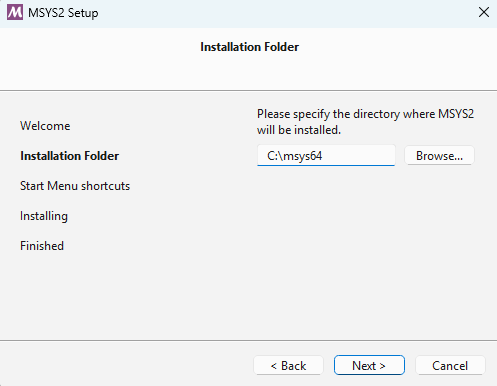
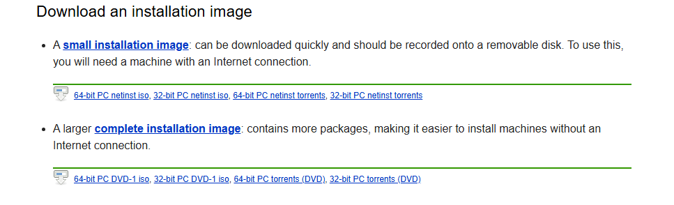
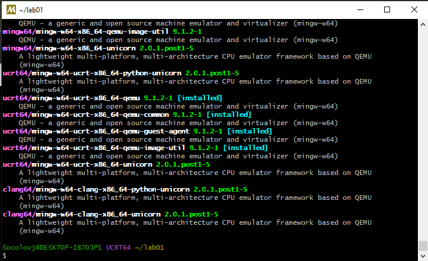
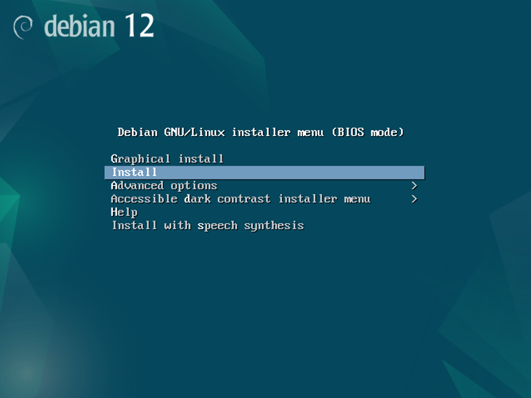
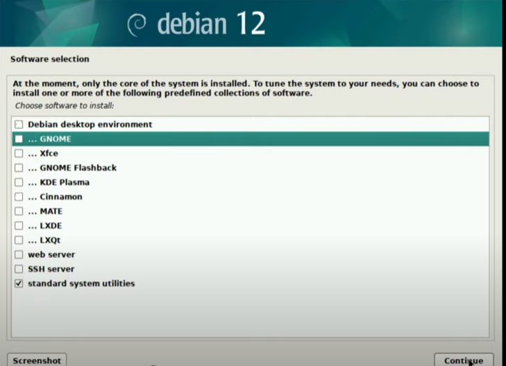
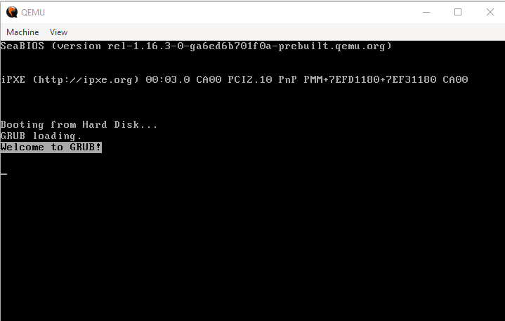

# Лабораторная работа №1. Виртуальный сервер

## Студент
**Соколов Даниил, группа I2302**  
**Дата выполнения: _09.02.2025_**  

## Описание задачи
Данная лабораторная работа знакомит с виртуализацией операционных систем и настройкой виртуального HTTP сервера. В ходе работы будет установлена виртуальная машина с Debian с гипервизором QEMU, развернут LAMP, установлены PhpMyAdmin и Drupal, а также выполнена настройка виртуальных хостов Apache. Также необходимо будеn завершите установку сайтов.

## Выполнение работы

### Подготовка
1. Скачиваю и устанавливаю MYSYS2
   
    

2. Открываю MYSYS2 и создаю папка `lab01` командой `mkdir lab01`
2. В папке `lab01` создаю папку `dvd` и файл `readme.md` командой `cat > readme.md`
3. Открываю оффициальынй сайт **Debian** и копирую ссылку на скачивание образа `64-bit PC DVD-1 iso`
   
   

5. Захожу в папку dvd `(cd dvd)` и в консоли выполняю команду для скачивания файла 
```sh
wget -O debian.iso https://cdimage.debian.org/debian-cd/current/amd64/iso-dvd/debian-12.9.0-amd64-DVD-1.iso
```
   `-O` - параметр, который сохраняет скаченный образ как `debian.iso`

7. Скачиваю и устанавливаю **QEMU** командой указанной на оффициальном сайте

   ```sh
   pacman -S mingw-w64-ucrt-x86_64-qemu
   ```
8. **QEMU** установлен.
   
    


### Установка ОС Debian на виртуальную машину
1. В консоли выполняю следующую команду, тем самым создаю образ диска для виртуальной машины размером 8 ГБ, формата qcow2:
   ```sh
   qemu-img create -f qcow2 debian.qcow2 8G
   ```
2. Запускаю установку OC Debian командой:
   ```sh
   qemu-system-x86_64 -hda debian.qcow2 -cdrom dvd/debian.iso -boot d -m 2G
   ```

   Я пытался произвести установку Debian несколько раз. Несколько раз после установки у меня не получалось запуситиь систему из-за бесконченого запуска с диска
   
   

   Удачной попыткой установки была установка с графическим интерфейсом.

    
   
3. Установку Debian произвел со следующими параметрами: 
   - Имя компьютера: **debian**
   - Хостовое имя: **debian.localhost**
   - Имя пользователя: **user**
   - Пароль пользователя: **password**

4. Во время устаановки на этапе Software Selection выбрал для установки только `standart system utilities`, то есть без графической оболочки и рабочего стола.

    

### Запуск виртуальной машины
После установки, с помощью следующей команды запустил систему с виртуального жесткого диска debian.qcow2 с 2Gb RAM, 2 ядрами, создаю NAT-сеть и настраивает проброс портов, что позволяет подключиться к веб-серверу на ВМ через `http://localhost:1080`:
```sh
qemu-system-x86_64 -hda debian.qcow2 -m 2G -smp 2 \
    -device e1000,netdev=net0 -netdev user,id=net0,hostfwd=tcp::1080-:80,hostfwd=tcp::1022-:22
```

    

### Установка LAMP
1. Переключение на суперпользователя:
   ```sh
   su
   ```
2. Обновление системы и установка пакетов:
   ```sh
   apt update -y
   apt install -y apache2 php libapache2-mod-php php-mysql mariadb-server mariadb-client unzip
   ```

### Установка PhpMyAdmin и CMS Drupal
1. Скачивание файлов:
   ```sh
   wget https://files.phpmyadmin.net/phpMyAdmin/5.2.2/phpMyAdmin-5.2.2-all-languages.zip
   wget https://ftp.drupal.org/files/projects/drupal-11.1.1.zip
   ```
2. Проверка наличия файлов:
   ```sh
   ls -l
   ```
3. Распаковка и перемещение файлов:
   ```sh
   mkdir /var/www
   unzip phpMyAdmin-5.2.2-all-languages.zip
   mv phpMyAdmin-5.2.2-all-languages /var/www/phpmyadmin
   unzip drupal-11.1.1.zip
   mv drupal-11.1.1 /var/www/drupal
   ```

### Настройка базы данных
```sh
mysql -u root
CREATE DATABASE drupal_db;
CREATE USER 'user'@'localhost' IDENTIFIED BY 'password';
GRANT ALL PRIVILEGES ON drupal_db.* TO 'user'@'localhost';
FLUSH PRIVILEGES;
EXIT;
```

### Настройка виртуальных хостов Apache
1. Созданы файлы конфигурации:
   - `/etc/apache2/sites-available/01-phpmyadmin.conf`
   - `/etc/apache2/sites-available/02-drupal.conf`
2. Регистрация конфигураций:
   ```sh
   /usr/sbin/a2ensite 01-phpmyadmin
   /usr/sbin/a2ensite 02-drupal
   ```
3. Добавлены записи в `/etc/hosts`:
   ```sh
   127.0.0.1 phpmyadmin.localhost
   127.0.0.1 drupal.localhost
   ```

### Запуск и тестирование
1. Проверка версии системы:
   ```sh
   uname -a
   ```
2. Перезапуск Apache:
   ```sh
   systemctl restart apache2
   ```
3. Проверка доступности сайтов в браузере:
   - `http://drupal.localhost:1080`
   - `http://phpmyadmin.localhost:1080`

## Ответы на вопросы
1. **Как скачать файл с помощью wget?**
   ```sh
   wget <URL>
   ```
2. **Зачем каждому сайту нужна своя база и пользователь?**  
   Это повышает безопасность и изолирует данные.
3. **Как сменить порт MySQL на 1234?**  
   Изменить параметр `port = 1234` в файле `/etc/mysql/my.cnf` и перезапустить сервер.
4. **Преимущества виртуализации?**  
   Изолированность, экономия ресурсов, удобство тестирования.
5. **Зачем настраивать временную зону?**  
   Для корректности логов и планирования задач.
6. **Размер установленной ОС?**  
   Определяется командой `du -sh /`.
7. **Рекомендации по разбиению диска?**  
   Использовать отдельные разделы для `/`, `/home`, `/var`, `/tmp`.

## Вывод
В ходе работы были освоены базовые принципы виртуализации, установка ОС, настройка веб-сервера и базы данных, развертывание CMS Drupal и PhpMyAdmin, а также базовая конфигурация виртуальных хостов Apache.

## Архивирование отчета
Файлы запакованы в архив `Sokolov-Daniil-lab01.md.zip` для сдачи в Moodle.

